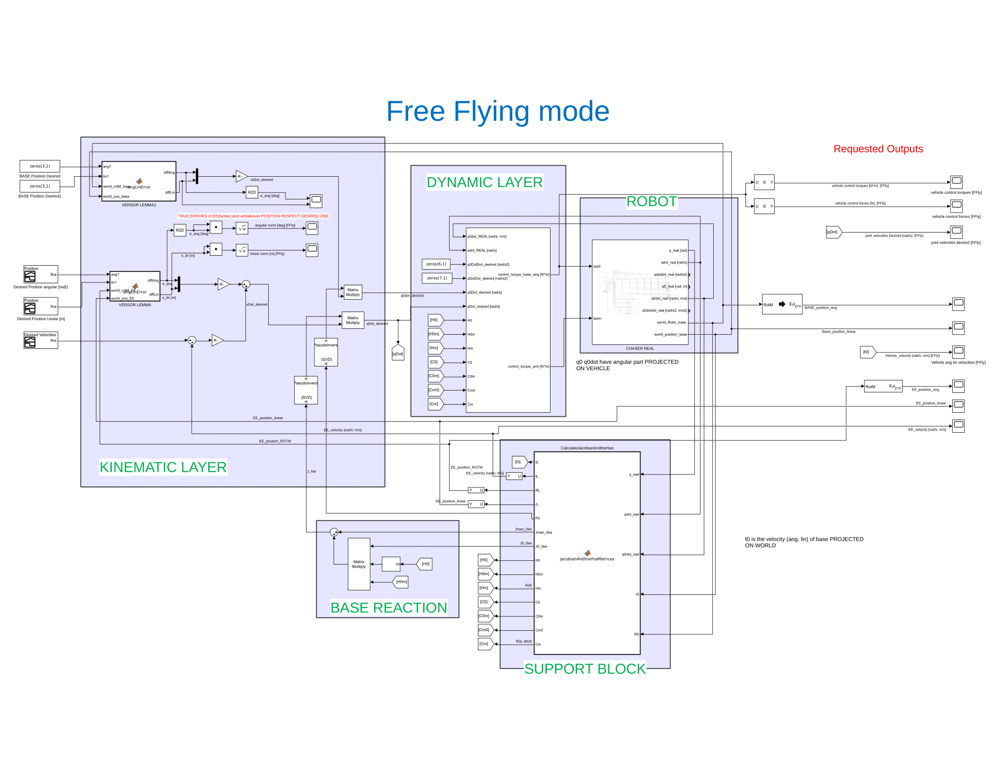

# SpaceManipulatorControl
_Simulink schemes to control a space manipulator to follow an end-effector trajectory._

The scheme is divided in 2 main layers: one kinematic layer and one dynamic layer. The aim is to track a desired end-effector trajectory (given as pose and velocity) to _ideally_ catch a space debris (the final grasping phase is not present). 
More information can be found in the [pdf](https://github.com/torydebra/SpaceManipulatorControl/blob/master/presentation.pdf).

### Tools
* Matlab/Simulink with Simscape Multibody
* [SPART](https://spart.readthedocs.io/en/latest/) SPAcecraft Robotic Toolkit
* Some function from my university ([simulation_script folder](https://github.com/torydebra/SpaceManipulatorControl/tree/master/matlab/simulation_scripts)), developed at [GRAAL](http://www.graal.dibris.unige.it/)

### Usage
* Clone repository
* Clone [SPART repository](https://github.com/NPS-SRL/SPART) and put it into same folder
*  Run main.m before launching any of the 4 simulink schemes:
	* FreeFloating
	* FreeFlying
	* Rotation FreeFlying
	* FreeFloating with Null Space Exploitation
